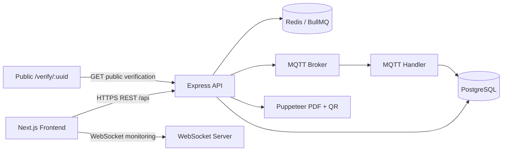

# Technical Software Requirements Specification (Tech SRS)
## Fastpec Online Monitoring System

**Status:** As-is technical baseline  
**Tanggal:** 19 Agustus 2026  
**Cakupan:** `oms-fastpec` dan `service-iot`

## 1. Tujuan dan Batas Sistem

SRS ini mendefinisikan arsitektur, kontrak integrasi, keamanan, model data logis, deployment, dan persyaratan teknis untuk aplikasi OMS kualitas air. Sumber utama adalah route/controller/service yang ada di workspace dan dokumen kontrak kalibrasi backend.

Sistem terdiri dari:



## 2. Stack dan Komponen

| Komponen | Implementasi | Tanggung jawab |
| --- | --- | --- |
| Frontend | Next.js 14, React 18, TypeScript 5 | Routing, UI, form, SSR prefetch, client state |
| API | Express 4, TypeScript, ts-node/tsc | REST endpoint, auth middleware, business logic |
| Persistence | PostgreSQL + Knex | Master, users, stations, sensor data, operations, calibrations |
| Auth | JWT (`jwt-simple`/helper internal), bcryptjs | Login, token validation, role claims |
| Query/cache UI | TanStack Query + Zustand | Fetch/cache server state, persisted auth state |
| Transport sensor | MQTT | Ingestion data dari perangkat |
| Live UI | `ws` WebSocket | Push monitoring ke browser |
| Queue/cache | Redis, BullMQ, node-cron | Background jobs, aggregation, retention, status |
| Document | Puppeteer, qrcode | PDF report dan QR PNG data URL |
| Upload/media | multer, signed URL/checksum helper | Dokumentasi foto kalibrasi |
| API documentation | swagger-jsdoc/swagger-ui-express | Swagger/OpenAPI dari anotasi route |

## 3. Runtime dan Konfigurasi

### Frontend

- `NEXT_PUBLIC_API_URL`: base URL untuk Axios; default kosong sehingga deployment dapat memakai reverse proxy/same-origin.
- Frontend berjalan pada port `5170` melalui `npm run dev`.
- Cookie sesi: `token`; persistence key Zustand: `auth-storage`.
- Request privat memakai `Authorization: Bearer <access_token>`.
- Axios timeout saat ini `6000000` ms; angka ini perlu ditinjau karena sangat besar untuk request web.

### Backend

- `PORT`: port HTTP API; default code `3000`.
- Database: `DB_CONNECTION`, `DB_HOST`, `DB_PORT`, `DB_USER`, `DB_PASSWORD`, `DB_DATABASE`.
- JWT: `JWT_SECRET_KEY`.
- MQTT: broker/topic/port dari `MQTT_*`; port default `1883`.
- Redis: host/port dari `REDIS_*`; port default `6379`.
- Logging: `LOG_DIR`, termasuk logger aplikasi dan MQTT.
- Public calibration URL: `PUBLIC_CALIBRATION_FRONTEND_URL` sebagai pilihan utama; `PUBLIC_CALIBRATION_BASE_URL` sebagai fallback kompatibilitas.
- Backend menyediakan Swagger UI dari `swaggerSpec`; path UI perlu dipastikan pada `main.ts` saat deployment.

Public calibration URL wajib HTTP/HTTPS dengan host publik. Host localhost, loopback, private IPv4, domain `.local`/`.internal` dan host satu label ditolak. QR selalu dibentuk dari konfigurasi tersebut, bukan header request.

## 4. Frontend Technical Requirements

### 4.1 Routing

| Route | Akses | Fungsi |
| --- | --- | --- |
| `/login` | Publik | Login |
| `/dashboard` | Protected | Ringkasan/list station |
| `/database` | Protected | Data pemantauan |
| `/history` | Protected | Histori dan export |
| `/monitoring/:id` | Protected/route exception perlu dikonfirmasi | Monitoring station live |
| `/newmonit` | Unprotected menurut middleware | Halaman monitoring alternatif |
| `/inventory` | Admin group | Inventory |
| `/mesin` | Admin group | Mesin/device |
| `/pengajuan` | Admin group | Pengajuan |
| `/stasiun` | Admin group | Master station |
| `/user` | Admin group | User |
| `/billing` | Protected | Summary/history billing |
| `/maintenance` | Protected | Maintenance |
| `/reports` | Protected | Maintenance reports |
| `/calibration` | Protected | List calibration |
| `/calibration/create` | Protected | Create draft |
| `/calibration/edit/:id` | Protected | Edit/autosave/submit |
| `/calibration/:id` | Protected | Detail/preview/QR |
| `/verify/:uuid` | Publik | Verifikasi laporan |

Middleware frontend mengecualikan path yang mengandung ekstensi/`_next`, auth route `/login`, API prefix `/api`, dan unprotected first path `monitoring`, `newmonit`, `verify`.

### 4.2 State dan data fetching

- SSR pages mem-prefetch station/billing menggunakan TanStack Query lalu melakukan hydration.
- Client pages memakai TanStack Query untuk calibration dan state lokal untuk reports.
- Auth disimpan di Zustand persist serta cookie token.
- Setelah mutation calibration berhasil, query list/detail di-invalidate.
- Error interceptor menampilkan toast; token expired/invalid menghapus sesi.

### 4.3 Validasi dan keamanan frontend

- Payload create/update calibration divalidasi dengan Zod schema.
- Notes ditampilkan melalui sanitizer helper; backend juga wajib sanitasi.
- Frontend tidak boleh mengarang `station_id`, `report_no`, status, officer, verification UUID, detail ID, atau standard ID.
- Nilai tanggal dikirim sebagai `YYYY-MM-DD`; decimal sebagai JSON number.

## 5. API Contract

Semua path berikut relatif terhadap base API `/api` jika backend dipasang di bawah prefix tersebut. Seluruh endpoint privat menggunakan Bearer JWT kecuali dinyatakan publik.

### 5.1 Auth dan publik

| Method | Path | Auth | Keterangan |
| --- | --- | --- | --- |
| POST | `/auth/login` | Public | Input `username`, `password`; output `success`, `user_data`, `token.access_token`, `expires_in`, `type`. |
| GET | `/verify/:uuid` | Public | Mengembalikan detail laporan kalibrasi yang valid untuk halaman verification. |
| GET | `/calibration-media/:docId` | Public signed URL | Streaming dokumentasi foto setelah signature/checksum valid. |

### 5.2 Monitoring dan data

| Group | Endpoint capability |
| --- | --- |
| `/data/station/*` | List/detail/create/update station dan monitoring relation sesuai route aktual |
| `/data/machine/*`, `/data/device/*` | Master/relasi mesin dan perangkat |
| `/data/user/*` | User list dan operasi admin |
| `/data/mqtt/list` | List data MQTT |
| `/data/mqtt/export` | Export data MQTT; header tersedia melalui `/data/mqtt/export/headers` |
| `/data/datamqtt/list` | List data buffer/history MQTT |
| `/data/station/monitoring` | Data monitoring station |
| `/data/ika` | Data/index IKA; middleware optional memungkinkan akses berbeda sesuai token |
| `/data/notifications` | List notification |
| `/data/notifications/read` | Tandai satu notification terbaca |
| `/data/notifications/read-all` | Tandai semua notification terbaca |
| `/monitoring/:uuid` | Detail monitoring station; WebSocket memakai pola `/monitoring/:id` |

Nama method dan payload detail mengikuti anotasi Swagger serta service API frontend. Kontrak OpenAPI perlu dijadikan artefak versioned karena route `data` cukup besar.

### 5.3 Inventory dan pengajuan

| Method | Path | Role utama | Keterangan |
| --- | --- | --- | --- |
| GET/POST | `/inventory/...` | `adm:eng` | Inventory list/create dan master terkait |
| GET/POST/PUT/DELETE | `/inventory/tracking[/:id]` | `adm:eng` | Tracking barang |
| GET | `/inventory/tracking/options` | `adm:eng` | Opsi dropdown tracking |
| GET/POST/PUT/DELETE | `/inventory/requests[/:id]` | `adm:eng` | Request inventory |
| PUT | `/inventory/requests/:id/approve` | `adm` | Approve request |
| PUT | `/inventory/requests/:id/reject` | `adm` | Reject request |
| PUT | `/inventory/requests/:id/process` | `adm` | Update proses request |
| GET/POST/PUT/DELETE | `/pengajuan/pulsa[/:id]` | `adm:eng` | Pengajuan pulsa |
| GET/POST/PUT/DELETE | `/pengajuan/token[/:id]` | `adm:eng` | Pengajuan token listrik |

### 5.4 Billing

| Method | Path | Role | Keterangan |
| --- | --- | --- | --- |
| GET | `/billing/summary` | `adm:eng:usr` | Ringkasan billing |
| GET | `/billing/history` | `adm:eng:usr` | Riwayat billing |
| PUT | `/billing/status` | `adm` | Update status billing |

### 5.5 Maintenance reports

Backend memiliki dua surface yang perlu disatukan/ditetapkan:

- `/reports` dengan `GET /`, `GET /:id`, `POST /`, `PUT /:id`.
- `/maintenance/reports` dengan route yang juga didefinisikan di `src/routes/maintenance/index.ts`.

Kontrak controller report:

- `GET /reports?station_uuid=&status=&limit=&offset=` mengembalikan `{ success, data, total }`.
- `GET /reports/:id` mengembalikan report dan `history` dari `maintenance_logs`.
- `POST /reports` menerima `title`, `station_uuid`, `description`, `category`; PIC dan status `Open` berasal dari user JWT.
- `PUT /reports/:id` menerima `title`, `description`, `category`, opsional `pic_id`/`pic_name`; penggantian PIC hanya admin.

Frontend service saat ini memanggil `/api/reports`; lakukan contract test untuk memastikan mount prefix deployment sesuai.

### 5.6 Calibration

Authorization:

- List, parameters, create, detail, update, delete, submit, print: `adm` atau `eng`.
- Approve: `adm` saja.
- Detail/update/delete/submit/print: owner check selain role.

| Method | Path | Keterangan |
| --- | --- | --- |
| GET | `/calibrations/parameters` | Master parameter dan standar CRM |
| GET | `/calibrations?limit=20&offset=0&status=` | List; engineer hanya melihat calibration yang dibuatnya |
| POST | `/calibrations` | Membuat draft |
| GET | `/calibrations/:id` | Detail station, parameters, standards, samples, QR |
| PUT | `/calibrations/:id` | Update metadata/detail/standards/samples/notes |
| DELETE | `/calibrations/:id` | Hanya status draft |
| POST | `/calibrations/:id/submit` | Submit draft yang lengkap |
| POST | `/calibrations/:id/approve` | Approve status submitted, admin |
| GET | `/calibrations/:id/print` | PDF terautentikasi |
| POST | `/calibrations/:id/details/:detailId/documentation/:slot` | Upload photo documentation |
| DELETE | `/calibrations/:id/details/:detailId/documentation/:slot` | Delete photo documentation |

Create minimum:

```json
{
  "station_id": 7,
  "calibration_start_date": "2026-08-10",
  "calibration_end_date": "2026-08-11",
  "parameter_ids": [2, 3, 4]
}
```

`station_id` harus berasal dari master station aktif; angka `7` hanya contoh. `officer_id` berasal dari JWT. Response create menghasilkan `id`, `report_no`, `status`, `verification_uuid`, `verification_url`, dan `qr_code_data_url`; frontend wajib memanggil detail setelah create untuk memperoleh `details[].id` dan `standards[].id`.

Update calibration menggunakan ID yang telah dikembalikan detail. Jika `waterSamples` dikirim, payload harus berisi seluruh sample yang ingin dipertahankan karena backend melakukan sinkronisasi koleksi dan menghapus existing sample yang ID-nya tidak dikirim.

Rules workflow:

- `draft` dan `submitted` editable menurut helper status, tetapi approval membuat record tidak editable.
- Delete hanya draft.
- Submit hanya draft, minimal satu parameter, semua standard memiliki hasil.
- Approve hanya submitted.
- `calculation_result`, status parameter, acceptable range, dan hasil perhitungan berasal dari backend.
- Notes hanya mempertahankan tag HTML terbatas tanpa atribut/event/style/media/link berbahaya.

### 5.7 Response dan error

Response sukses umumnya memiliki `success: true`, optional `message`, `data`, dan untuk list optional `total`. Error minimal membawa `success: false` dan `message`.

HTTP/error behavior yang wajib dipertahankan:

- `401`: token hilang/expired/invalid atau role ditolak oleh middleware yang saat ini memakai 401.
- `400`: field wajib, tanggal invalid, hasil kalibrasi belum lengkap.
- `404`: resource tidak ditemukan.
- `500`: konfigurasi public URL tidak valid atau internal error.

Tim perlu menormalkan penggunaan `401` versus `403` untuk role authenticated yang tidak berwenang.

## 6. Model Data Logis

Entitas utama yang terdeteksi dari migration/query/controller:

- `users`: identitas login, username, fullname, role, JWT subject.
- `stations`: station name, address, coordinate, city, UUID/ID.
- `devices`/`machines`: perangkat sensor dan relasi station.
- `mqtt_monitoring`: kondisi/latest monitoring sensor.
- `mqtt_datas`: buffer/history data MQTT.
- `mqtt_datas_archive`: data historis yang dipindahkan retention job.
- `calibrations`: report number, station, officer, date range, status, notes, verification UUID.
- `calibration_details`: parameter, coefficient, reference/reading, calculation result, remark.
- `calibration_standards`: CRM name/value, acceptable range, calibration result.
- `calibration_water_samples`: sample air dan parameter pengukuran.
- `calibration_documentations`: foto per detail/slot, checksum/signature metadata.
- `reports`: maintenance report, station, PIC, category, status, timestamps.
- `maintenance_logs`: riwayat report.
- `inventory` dan `inventory_requests`: stok, tracking, permintaan, approval/process.
- `billing`/operational tables: ringkasan dan histori billing/pengajuan.
- `notifications`: notification dan read state.

Foreign key dan nullability final harus dirujuk dari migration PostgreSQL per environment. SRS ini sengaja tidak mengunci tipe kolom yang belum konsisten di semua migration.

## 7. Ingestion, Processing, dan Real-Time

1. `MqttHandler` connect ke broker dan subscribe ke `MQTT_TOPIC`.
2. Pesan di-parse dan dikelompokkan untuk batch insert.
3. Data monitoring current state disimpan pada `mqtt_monitoring`.
4. Data historis/buffer disimpan pada `mqtt_datas` bila memiliki relasi yang dibutuhkan.
5. Worker/queue Redis menjalankan aggregation dan pekerjaan background.
6. Cron menangani process/sync, offline status, aggregation, dan retention.
7. WebSocket server menerima client monitoring dan broadcaster mengambil kondisi terbaru untuk dikirim.

Persyaratan teknis:

- Reconnect MQTT harus memiliki logging dan tidak menggandakan data secara tidak terkendali.
- Flush batch harus atomic per chunk atau memiliki strategi retry/idempotency.
- Queue job harus dapat dipantau dan diulang tanpa membuat duplikasi.
- Retention harus memindahkan data ke archive sebelum delete dan memiliki backup.
- WebSocket harus membersihkan client disconnected dan membatasi akses/eksposur data sesuai kebijakan publik.

## 8. Keamanan

- Semua endpoint privat memakai JWT Bearer middleware.
- Role access list ditentukan pada route, misalnya `adm:eng`, `adm:eng:usr`, atau `adm`.
- Calibration single-record routes menambahkan ownership enforcement.
- Password harus tetap di-hash dengan bcrypt; secret tidak boleh berada di source.
- API production wajib di belakang HTTPS dan CORS allowlist.
- Error response tidak boleh membocorkan SQL, secret, token, atau path filesystem.
- Notes disanitasi saat write/read; output HTML hanya boleh dirender melalui sanitizer.
- Dokumentasi foto memakai signed preview URL dan SHA-256 checksum helper.
- QR/public verification hanya menerima konfigurasi public URL tervalidasi.
- Tambahkan rate limiting untuk login dan endpoint publik verification/media sebelum production exposure.

## 9. Observability dan Operasi

Minimal yang disyaratkan:

- Structured/application log dan MQTT log terpisah.
- Correlation/request ID untuk menelusuri ingest sampai response.
- Health check API, database, Redis, dan MQTT.
- Metric jumlah message MQTT, batch flush error, queue lag, WebSocket clients, API latency/error rate.
- Alert token signing failure, database unavailable, MQTT disconnect berkepanjangan, queue failure, dan disk storage penuh.
- Backup PostgreSQL dan uji restore berkala.
- Retention policy untuk MQTT raw/history, attachment, log, dan archive.

## 10. Testing Requirements

### Frontend

- Unit/component tests untuk calibration list, create, edit, detail, QR, preview, notes sanitizer.
- Contract tests yang mem-mock response API sesuai backend, termasuk 401/400/404.
- Cypress E2E login, dashboard, monitoring, database/history export, calibration workflow, dan public verification.
- Responsive smoke test untuk halaman protected dan verification.

### Backend

- Unit test calculator, status transition, completeness validation, public URL validation, notes sanitizer, signed media.
- Integration test route dengan PostgreSQL test database untuk auth, role, ownership, report, calibration, inventory.
- MQTT ingestion test dengan broker/test double dan verifikasi persistence.
- Queue/cron test untuk retry, aggregation, offline, retention.
- API contract test menghasilkan/mengecek OpenAPI.

### Acceptance smoke test

1. Login role `adm`, `eng`, `usr`.
2. Akses endpoint role-valid dan role-invalid.
3. Submit data sensor test.
4. Terima update monitoring melalui WebSocket.
5. Create/edit/submit/approve calibration.
6. Print PDF dan buka QR verification.
7. Buat report maintenance dan baca history.
8. Jalankan inventory request approve/reject/process.

## 11. Deployment

Deployment minimal memerlukan:

- Frontend Next.js process/container.
- Backend Node.js process/container.
- PostgreSQL.
- Redis.
- MQTT broker.
- Persistent storage untuk log, upload, dan archive.
- Reverse proxy/TLS untuk frontend, API, WebSocket, dan public verification.

Urutan deployment yang disarankan:

1. Provision secrets dan environment per stage.
2. Migrasikan database secara backward-compatible.
3. Deploy backend dan health-check database/Redis/MQTT.
4. Deploy frontend dengan `NEXT_PUBLIC_API_URL` yang benar.
5. Uji login, monitoring WebSocket, calibration QR, dan PDF.
6. Aktifkan worker/cron setelah API siap.
7. Monitor error rate dan queue/MQTT lag.

Perintah yang terdeteksi:

- Frontend: `npm run dev`, `npm run build`, `npm run start`, `npm run test`, `npm run e2e`.
- Backend: `npm run dev`, `npm run build`, `npm run serve`, `npm run migrate`, `npm test`.

## 12. Open Technical Issues

| ID | Isu | Dampak | Tindakan |
| --- | --- | --- | --- |
| TECH-01 | Frontend report service memakai `/api/reports`; backend punya `/reports` dan `/maintenance/reports`. | Risiko 404/kontrak ganda. | Tetapkan canonical endpoint dan integration test. |
| TECH-02 | Role UI memakai `admin`/`engineering`, middleware memakai `adm`/`eng`. | Tombol/akses dapat tidak konsisten. | Tetapkan role enum dan mapping tunggal. |
| TECH-03 | Beberapa menu frontend dikomentari walau backend endpoint ada. | Kapabilitas backend belum berarti fitur rilis. | Putuskan release scope dan acceptance UI. |
| TECH-04 | Tidak semua route `data` memiliki kontrak payload terpusat. | Perubahan backend rawan mematahkan frontend. | Publish OpenAPI versioned dan generated types. |
| TECH-05 | Status code unauthorized role masih 401 pada middleware. | Client tidak dapat membedakan sesi invalid vs forbidden. | Gunakan 401 untuk auth dan 403 untuk authorization. |
| TECH-06 | Timeout Axios sangat besar. | Request menggantung lama dan membebani browser/API. | Tetapkan timeout per operation dan cancellation. |
| TECH-07 | SLA, retention, backup, dan observability belum menjadi konfigurasi terdokumentasi. | Risiko operasional production. | Tambahkan runbook dan target NFR terukur. |
| TECH-08 | WebSocket route/access contract belum versioned. | Perubahan live monitoring sulit diuji lintas release. | Dokumentasikan handshake, event schema, reconnect, auth. |

## 13. Traceability

| Kebutuhan PRD | Implementasi utama |
| --- | --- |
| FR-01 Auth | `src/routes/auth/login.ts`, frontend auth store/login API |
| FR-02 Role | `src/middlewares/jwtMiddleware.ts`, route middleware |
| FR-03 Ingestion | `src/config/mqttHandler.ts`, MQTT tables |
| FR-04 Monitoring/history | `src/routes/monitoring`, `src/routes/data`, frontend section components |
| FR-05 Export | data MQTT/export routes, frontend history/database export services |
| FR-06 Admin/operations | `src/routes/data`, `inventory`, `pengajuan`, `billing` |
| FR-07 Maintenance report | `src/controllers/ReportController.ts`, frontend reports/maintenance |
| FR-08 Calibration workflow | `src/routes/calibration`, `CalibrationController`, frontend calibration pages |
| FR-09 QR | `getVerificationUrl`, `qrcode`, calibration detail/QR component |
| FR-10 Notes security | `CalibrationApiContract`, frontend calibration notes sanitizer |
| FR-11 Public verification | `/verify/:uuid`, frontend `src/app/verify/[uuid]/page.tsx` |
